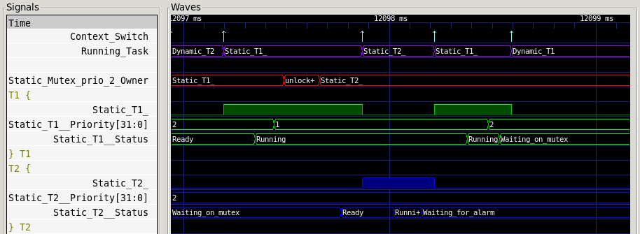

# AGATE
Playing with the idea of a tasking/RTOS library in Ada

## Setup

You will need an installation of GNAT for ARM Cortex-M (AKA arm-elf, AKA
arm-eabi):

If you don't have access to the Pro edition, there's a community version
available on the AdaCore website:
[www.adacore.com/download](https://www.adacore.com/download).

## Build

To build the project, simply run `gprbuild`:
```
$ gprbuild -j0 -P agate.gpr -XGNATEMU_BOARD=STM32F4
```

(Don't mind the warnings...)

## Run
You can try the project in GNATemulator (QEMU) provided with GNAT:
```
$ arm-eabi-gnatemu -P agate.gpr obj/main
---> Dynamic T2 Wait_For_Signal on Dynamic_Semaphore
---> Static T2 Wait_For_Signal on Static_Semaphore
---> Static T1 Signal Static_Semaphore
---> Static T2 released
---> Static T2 Clock: 4595
---> Static T1 Wait_Lock on Static_Mutex
---> Static T1 Got the mutex
---> Static T1 Clock: 5228
---> Dynamic T1 Signal Dynamic_Semaphore
---> Dynamic T2 released
---> Dynamic T2 Clock: 5556
---> Dynamic T2 Clock: 1008388
---> Dynamic T2 Clock: 2016409
---> Static T1 Release Static_Mutex
---> Static T1 Wait_Lock on Static_Mutex
---> Static T1 Got the mutex
---> Static T1 Clock: 2017081
[...]
```

The execution of the example will produce a
[VCD](https://en.wikipedia.org/wiki/Value_change_dump) trace file that can be
open with [GTKwave](http://gtkwave.sourceforge.net/).

```
$ gtkwave agate_traces.vcd
```

For instance here we see the ownership of a mutex going from task T1 to task
T2:



You can also see T1 priority change because of the priority inheritance.
